# SlipStream

SlipStream is a telemetry-first racing coach for Forza telemetry.

The core idea is:

`telemetry -> measurable driving behavior -> time-loss analysis -> structured findings`

The system is built as an engineering-driven pipeline first. Any future AI or ML layer should explain or extend findings that already come from telemetry analysis rather than replacing it.

## Architecture

```mermaid
flowchart LR
forzaUdp[ForzaUDPTelemetry] --> rawLogger[RawLapLogger]
rawLogger --> rawStore[RawLapCSVs + SessionMetadata]
rawStore --> canonicalBuilder[CanonicalLapProcessing]
canonicalBuilder --> processedStore[ProcessedLapStore]
processedStore --> cornerRecords[CornerRecordExtraction]
cornerRecords --> baselines[PerCornerBaselines]
baselines --> detectors[SevenDetectors]
detectors --> findings[RankedFindings]
findings --> api[FastAPI]
api --> frontend[React UI]
```



## Pipeline Stages

### Ingest
- Raw Forza UDP capture into per-lap CSV files
- Session metadata with track enrichment from `TrackOrdinal`

### Processing
- Canonical processed lap generation with distance alignment and resampling
- Track segmentation into corner and straight definitions
- Derived telemetry features: longitudinal acceleration, throttle/brake rates, steering rate/smoothness, coasting flags

### Analysis
- Corner record extraction per lap
- Per-corner baselines built from the reference (best) lap
- Seven detectors run against each corner record against its baseline
- Findings pipeline: confidence scoring, severity classification, templated text, mutual suppression, per-corner and session caps

### API
- FastAPI backend serving sessions, laps, lap comparison, telemetry capture, and analysis results

### Frontend
- React + TypeScript UI with pages for session library, session detail, lap review, lap comparison, and corner analysis

## Detectors

| Detector | What it catches |
|---|---|
| `early_braking` | Braking started earlier than the reference lap |
| `late_braking` | Braking started later, costing apex and exit speed |
| `trail_brake_past_apex` | Brake overlap past the apex distance |
| `over_slow_mid_corner` | Mid-corner speed significantly below baseline |
| `exit_phase_loss` | Late throttle application on exit |
| `weak_exit` | Below-baseline exit speed fraction |
| `steering_instability` | Excess steering correction in the corner |

## Findings Pipeline

1. **Confidence scoring** — `pattern_strength` combined with cost-significance and alignment-quality sub-scores into `[0, 1]`
2. **Confidence gate** — hits below `CONFIDENCE_MIN` are dropped
3. **Severity classification** — binned from `time_loss_s` into minor / moderate / major
4. **Templated text** — deterministic per detector
5. **Mutual suppression** — `over_slow_mid` suppressed when `trail_brake_past_apex` fires on the same corner/lap; `exit_phase_loss` suppressed when `over_slow_mid` has a larger time loss
6. **Per-corner cap** — top N findings per corner by ranking key
7. **Session cap** — top findings surfaced as `findings_top`; the rest go to `findings_all`

## Repository Layout

```
src/
  ingest/
    datacollector.py        UDP capture, raw lap logging, session metadata
    raceplots.py            debug plots for raw and processed laps
  processing/
    distance.py             canonical processed-lap builder and feature engineering
    alignment.py            lap resampling and alignment helpers
    segmentation.py         corner and straight definitions from track data
    validation.py           lap validation utilities
  analysis/
    session_analysis.py     session-level orchestrator, writes session_analysis.json
    corner_records.py       CornerRecord and StraightRecord extraction
    baselines.py            per-corner baseline construction from the reference lap
    detectors.py            seven pure-function detectors
    findings.py             confidence scoring, suppression, ranking, Finding/FindingSet
    templates.py            deterministic text templates for each detector
    constants.py            all tunable thresholds in one place
  core/
    config.py               paths and environment config
    constants.py            shared signal constants
    schemas.py              shared dataclasses and column names
    tracks.py               TrackOrdinal lookup table
  api/
    app.py                  FastAPI app with CORS and gzip
    models.py               API request/response models
    routes/
      sessions.py           session listing and metadata
      laps.py               lap retrieval and processed lap data
      compare.py            multi-lap comparison endpoint
      capture.py            live capture start/stop
      analysis.py           session analysis results
    services/
      session_scanner.py    scans processed data directory for sessions
      capture_manager.py    manages the UDP capture subprocess
frontend/
  src/
    pages/                  HomePage, SessionsPage, SessionDetailPage,
                            LapReviewPage, LapComparePage, AnalysisPage
    components/             LapChart, MultiLapChart, TrackMap, CompareTrackMap,
                            CornerAnalysisPanel, CornerDetailView, AppNavigation,
                            Layout, StatusBadge, SessionLibraryRow, AppearanceDrawer
    api/                    typed API client
    hooks/                  data-fetching hooks
    types/                  shared TypeScript types
    utils/                  helpers
run_phase1_review.py        choose a raw lap, process it, open debug plots
tests/                      fixture-based coverage for ingest, processing, and analysis
```

## Canonical Processed Lap

Processed laps are the single source of truth for downstream analysis.

Fields include:

- **Sample timing**: `TimestampMS`, `ElapsedTimeS`, `DeltaTimeS`
- **Path alignment**: `CumulativeDistanceM`, `NormalizedDistance`
- **Core signals**: speed, RPM, throttle, brake, steering, gear, power, torque, boost, position
- **Derived signals**: longitudinal acceleration, throttle/brake rates, steering rate, steering smoothness, coasting flags
- **Lap-level fields**: `LapTimeS`, `LapIsValid`

## Setup

```bash
python3 -m pip install -r requirements.txt
```

For the frontend:

```bash
cd frontend && npm install
```

## Usage

Capture a raw session:

```bash
python3 src/ingest/datacollector.py --ip 127.0.0.1 --port 5300
```

Build processed laps for a session:

```bash
python3 src/processing/distance.py data/raw/session_20260316_120000
```

Run session analysis (writes `session_analysis.json`):

```bash
python3 -m src.analysis.session_analysis data/processed/session_20260316_120000
```

Start the API server:

```bash
uvicorn src.api.app:app --reload --port 8000
```

Start the frontend dev server:

```bash
cd frontend && npm run dev
```

Plot a raw or processed lap for debugging:

```bash
python3 src/ingest/raceplots.py data/processed/session_20260316_120000/lap_001.csv
```

Run tests:

```bash
python3 -m unittest discover -s tests -v
```
